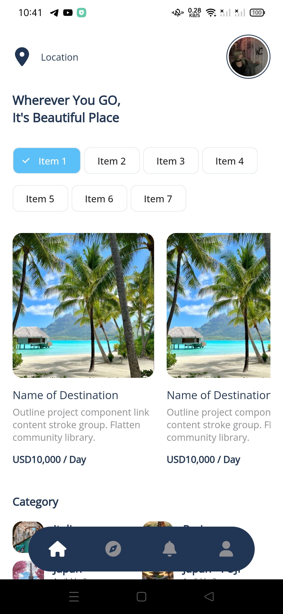
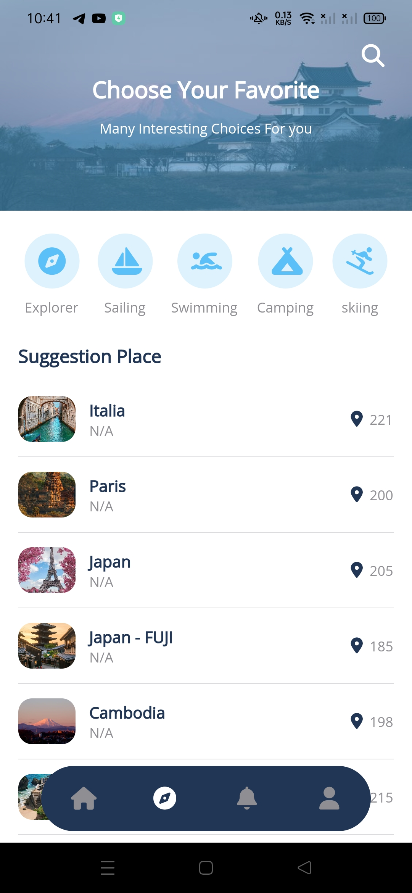
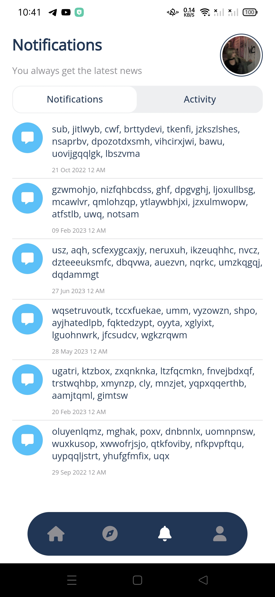
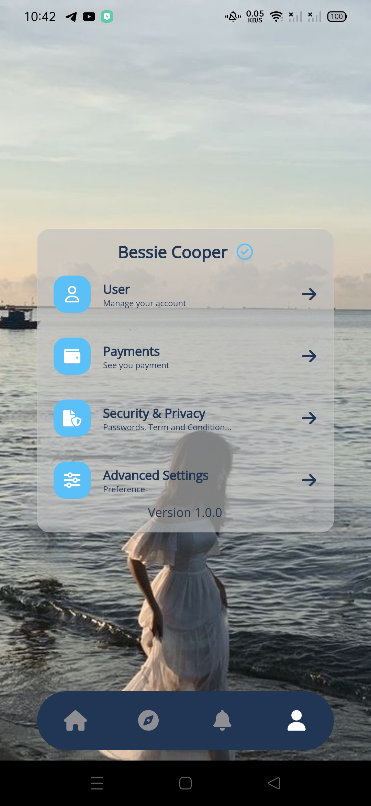
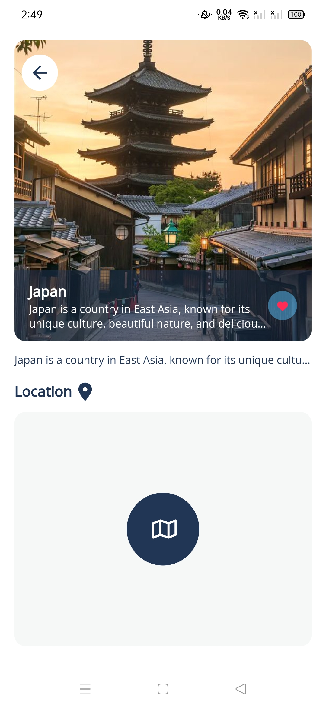
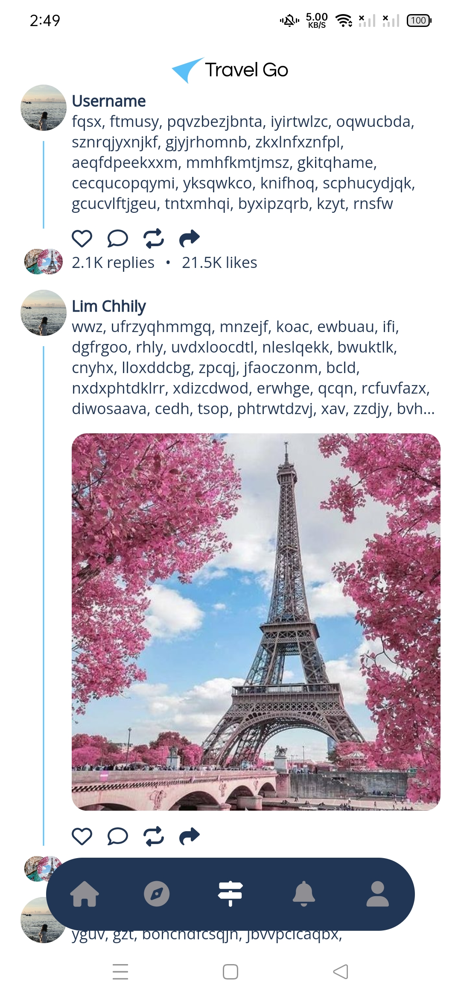

# travel_go

This is a Flutter application that uses Material 3 to create a Travel application.

## Used Packages

* cupertino_icons: ^1.0.5
* google_fonts: ^5.1.0
* font_awesome_flutter: ^10.5.0
* cached_network_image: ^3.2.3
* intl: ^0.18.1

### Font

* openSans (English)

# Screenshot

    
    
    
    
    
    

